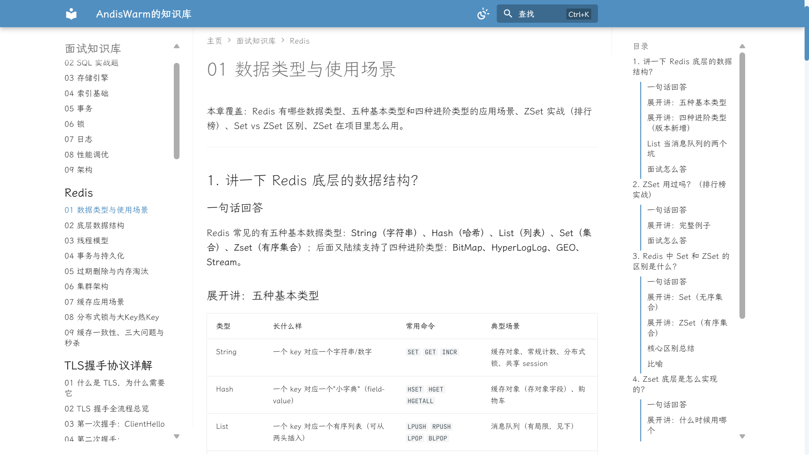
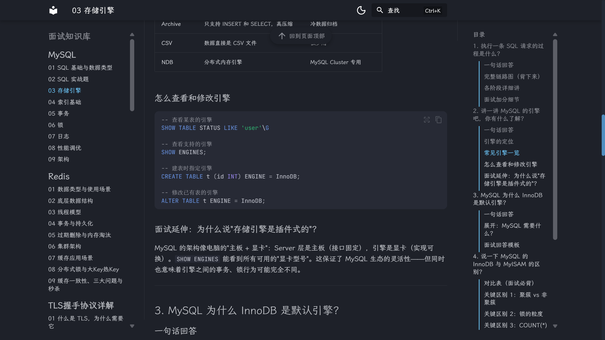
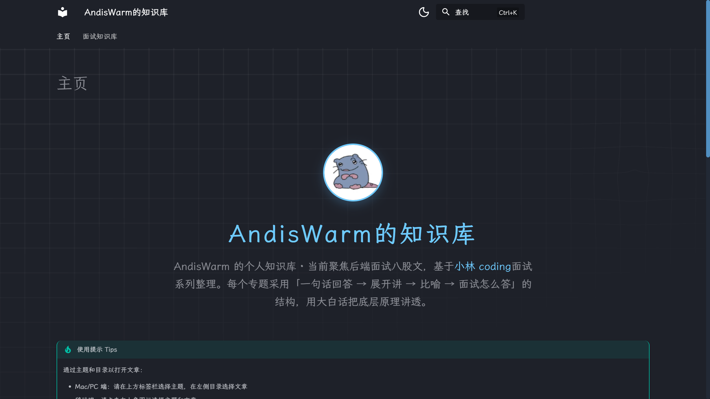

# Zensical 知识文档站点

基于 [Zensical](https://zensical.org/)（Material for MkDocs 官方继任者）构建的 Markdown 文档平台。文档源为项目内的 `docs/` 目录（面试知识库 + 项目实战知识库），直接编辑 `docs/` 即可更新站点。

## 效果展示







## 使用

```powershell
# 1. 首次使用：安装依赖（一次性）
pip install deepmerge click jinja2 markdown pygments pymdown-extensions pyyaml tomli

# 2. 新增/改名文档后：重新生成导航并构建
powershell -ExecutionPolicy Bypass -File build.ps1
# 后台持续监听 docs/，改动自动重建（Ctrl+C 退出）
powershell -ExecutionPolicy Bypass -File watch.ps1

# 3. 本地预览（http://localhost:8000）
$env:PYTHONPATH = "F:\知识库\博客网站集合\zensical-0.0.56-cp310-abi3-win_amd64"
python -m zensical serve

# 4. 构建静态站点（输出到 site/）
python -m zensical build
```

## 目录结构

- `zensical.toml` — 站点配置（站点名、导航 nav、主题、Markdown 扩展）
- `docs/` — 文档源（站点的唯一内容来源，文章直接在此编辑）
- `site/` — 构建产物
- `build.ps1` — 重新生成导航 + 构建脚本（文档新增/改名后运行）
- `watch.ps1` — 监听 `docs/` 改动并自动重建
- `gen_zensical_config.py` — nav 自动生成脚本（扫描 docs/ 生成 zensical.toml 的 nav 部分）
- `zensical/` — zensical 包本体（本地解压版）

## 工作机制与注意事项

1. **文档即源码**：`docs/` 是站点的唯一内容来源，直接在里面新增/修改 Markdown；改完运行 `build.ps1`（或 `watch.ps1` 自动）重新生成导航并构建。
2. **新增文档**：在 `docs/` 新建章节后运行 `build.ps1`，`gen_zensical_config.py` 会自动扫描 `docs/` 重新生成 nav。
3. **中文锚点**：站点配置了 `pymdownx.slugs.slugify` 以保留中文标题锚点（如 `#一先还原场景这段话在说什么`）。
4. **本地修改**：`zensical/config.py` 有两处本地补丁（允许绝对路径 docs_dir、外部目录时跳过 relative_to），当前配置使用项目内 `docs/` 不受影响。

## 参考

- [Zensical 中文教程](https://wcowin.work/Zensical-Chinese-Tutorial/)（Wcowin）
- [Zensical 官方文档](https://zensical.org/docs/)