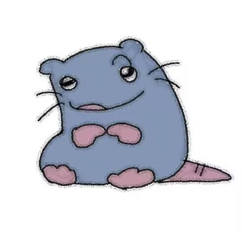

---
hide:
  - navigation
  - toc
title: 主页
---

  
  
AndisWarm的知识库

  
AndisWarm 的个人知识库 · 当前聚焦后端面试八股文，基于<a href="https://www.xiaolincoding.com/" target="_blank">小林 coding</a>面试系列整理。每个专题采用「一句话回答 → 展开讲 → 比喻 → 面试怎么答」的结构，用大白话把底层原理讲透。

!!! tip "使用提示 Tips"

    通过主题和目录以打开文章：

    - **Mac/PC 端**：请在上方标签栏选择主题，在左侧目录选择文章
    - **移动端**：请点击左上角图标选择主题和文章
    - 也可以使用顶部**搜索**关键词快速打开文章

## 目录

-   <svg xmlns="http://www.w3.org/2000/svg" viewBox="0 0 24 24" fill="none" stroke="currentColor" stroke-linecap="round" stroke-linejoin="round" stroke-width="2" class="card-icon"><ellipse cx="12" cy="5" rx="9" ry="3"/><path d="M3 5v14a9 3 0 0 0 18 0V5"/><path d="M3 12a9 3 0 0 0 18 0"/></svg> **MySQL 面试知识讲解**

    ---

    SQL 基础、索引、事务、锁、日志、性能调优、主从与分库分表

    [开始学习 →](MySQL面试知识讲解/README.md)

-   <svg xmlns="http://www.w3.org/2000/svg" viewBox="0 0 24 24" fill="none" stroke="currentColor" stroke-linecap="round" stroke-linejoin="round" stroke-width="2" class="card-icon"><path d="M2.97 12.92A2 2 0 0 0 2 14.63v3.24a2 2 0 0 0 .97 1.71l3 1.8a2 2 0 0 0 2.06 0L12 19v-5.5l-5-3zM7 16.5l-4.74-2.85M7 16.5l5-3M7 16.5v5.17M12 13.5V19l3.97 2.38a2 2 0 0 0 2.06 0l3-1.8a2 2 0 0 0 .97-1.71v-3.24a2 2 0 0 0-.97-1.71L17 10.5zM17 16.5l-5-3M17 16.5l4.74-2.85M17 16.5v5.17"/><path d="M7.97 4.42A2 2 0 0 0 7 6.13v4.37l5 3 5-3V6.13a2 2 0 0 0-.97-1.71l-3-1.8a2 2 0 0 0-2.06 0zM12 8 7.26 5.15M12 8l4.74-2.85M12 13.5V8"/></svg> **Redis 面试知识讲解**

    ---

    数据类型、底层结构、线程模型、持久化、缓存场景、分布式锁与大 Key

    [开始学习 →](Redis面试知识讲解/README.md)

-   <svg xmlns="http://www.w3.org/2000/svg" viewBox="0 0 24 24" fill="none" stroke="currentColor" stroke-linecap="round" stroke-linejoin="round" stroke-width="2" class="card-icon"><path d="M15 6a9 9 0 0 0-9 9V3"/><circle cx="18" cy="6" r="3"/><circle cx="6" cy="18" r="3"/></svg> **分布式面试知识讲解**

    ---

    分布式理论、分布式锁、分布式 ID、分布式事务

    [开始学习 →](分布式面试知识讲解/README.md)

-   <svg xmlns="http://www.w3.org/2000/svg" viewBox="0 0 24 24" fill="none" stroke="currentColor" stroke-linecap="round" stroke-linejoin="round" stroke-width="2" class="card-icon"><path d="M12 20v2M12 2v2M17 20v2M17 2v2M2 12h2M2 17h2M2 7h2M20 12h2M20 17h2M20 7h2M7 20v2M7 2v2"/><rect width="16" height="16" x="4" y="4" rx="2"/><rect width="8" height="8" x="8" y="8" rx="1"/></svg> **操作系统面试知识讲解**

    ---

    用户态/内核态、进程线程、IPC、调度、锁与死锁、内存、中断、网络 IO

    [开始学习 →](操作系统面试知识讲解/README.md)

-   <svg xmlns="http://www.w3.org/2000/svg" viewBox="0 0 24 24" fill="none" stroke="currentColor" stroke-linecap="round" stroke-linejoin="round" stroke-width="2" class="card-icon"><rect width="6" height="6" x="16" y="16" rx="1"/><rect width="6" height="6" x="2" y="16" rx="1"/><rect width="6" height="6" x="9" y="2" rx="1"/><path d="M5 16v-3a1 1 0 0 1 1-1h12a1 1 0 0 1 1 1v3M12 12V8"/></svg> **计算机网络面试知识讲解**

    ---

    网络模型、HTTP/HTTPS、DNS、Cookie/Session/JWT、TCP 握手挥手、网络安全

    [开始学习 →](计算机网络面试知识讲解/README.md)

-   <svg xmlns="http://www.w3.org/2000/svg" viewBox="0 0 24 24" fill="none" stroke="currentColor" stroke-linecap="round" stroke-linejoin="round" stroke-width="2" class="card-icon"><path d="M2.992 16.342a2 2 0 0 1 .094 1.167l-1.065 3.29a1 1 0 0 0 1.236 1.168l3.413-.998a2 2 0 0 1 1.099.092 10 10 0 1 0-4.777-4.719"/></svg> **消息队列面试知识讲解**

    ---

    MQ 选型、消息可靠性、幂等与积压、事务消息、RocketMQ/Kafka/RabbitMQ

    [开始学习 →](消息队列面试知识讲解/README.md)

-   <svg xmlns="http://www.w3.org/2000/svg" viewBox="0 0 24 24" fill="none" stroke="currentColor" stroke-linecap="round" stroke-linejoin="round" stroke-width="2" class="card-icon"><path d="M12.83 2.18a2 2 0 0 0-1.66 0L2.6 6.08a1 1 0 0 0 0 1.83l8.58 3.91a2 2 0 0 0 1.66 0l8.58-3.9a1 1 0 0 0 0-1.83z"/><path d="M2 12a1 1 0 0 0 .58.91l8.6 3.91a2 2 0 0 0 1.65 0l8.58-3.9A1 1 0 0 0 22 12"/><path d="M2 17a1 1 0 0 0 .58.91l8.6 3.91a2 2 0 0 0 1.65 0l8.58-3.9A1 1 0 0 0 22 17"/></svg> **消息队列主题是什么**

    ---

    Topic 概念的专题讲解，用「订阅杂志」类比讲透

    [开始学习 →](消息队列主题是什么/README.md)

-   <svg xmlns="http://www.w3.org/2000/svg" viewBox="0 0 24 24" fill="none" stroke="currentColor" stroke-linecap="round" stroke-linejoin="round" stroke-width="2" class="card-icon"><rect width="20" height="8" x="2" y="2" rx="2" ry="2"/><rect width="20" height="8" x="2" y="14" rx="2" ry="2"/><path d="M6 6h.01M6 18h.01"/></svg> **系统设计面试知识讲解**

    ---

    秒杀、RPC、短链、点赞、分布式 ID、订单超时、QPS 暴涨应对

    [开始学习 →](系统设计面试知识讲解/README.md)

-   <svg xmlns="http://www.w3.org/2000/svg" viewBox="0 0 24 24" fill="none" stroke="currentColor" stroke-linecap="round" stroke-linejoin="round" stroke-width="2" class="card-icon"><path d="M12 5v16M20.001 19A2 2 0 0 0 22 17V5a2 2 0 0 0-1.999-2L16 3.002A5 5 0 0 0 12 5a5 5 0 0 0-4-2H4a2 2 0 0 0-2 2v12a2 2 0 0 0 1.999 2H8a5 5 0 0 1 4 2 5 5 0 0 1 4-2z"/></svg> **后端技术进阶之路**

    ---

    计算机基础、数据库、设计模式、MQ、系统设计、高并发、分布式、微服务、云原生

    [开始学习 →](后端技术进阶之路/README.md)

-   <svg xmlns="http://www.w3.org/2000/svg" viewBox="0 0 24 24" fill="none" stroke="currentColor" stroke-linecap="round" stroke-linejoin="round" stroke-width="2" class="card-icon"><path d="M20 13c0 5-3.5 7.5-7.66 8.95a1 1 0 0 1-.67-.01C7.5 20.5 4 18 4 13V6a1 1 0 0 1 1-1c2 0 4.5-1.2 6.24-2.72a1.17 1.17 0 0 1 1.52 0C14.51 3.81 17 5 19 5a1 1 0 0 1 1 1z"/></svg> **TLS 握手协议详解**

    ---

    TLS 是什么、握手全流程、数字证书与 CA、常见疑问与 TLS 1.3

    [开始学习 →](TLS握手协议详解/README.md)

## 阅读建议

1. 先从 **MySQL / Redis** 入手，这两块是后端面试最高频考点；
2. 再补 **操作系统** 与 **计算机网络** 的基础知识；
3. 然后进入 **消息队列** 与 **分布式** 的中级内容；
4. 最后用 **系统设计** 与 **后端技术进阶之路** 串联成完整的架构认知。

## 参考来源

- [小林 coding 面试系列](https://www.xiaolincoding.com/interview/)

