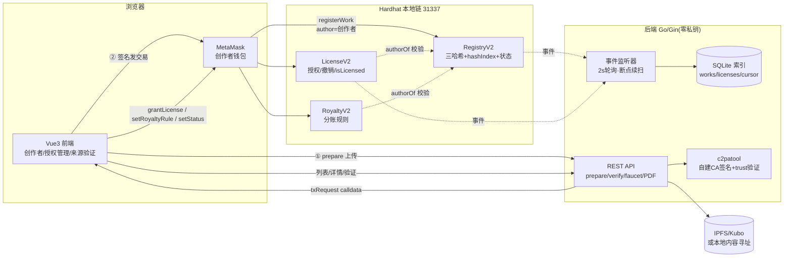

# ImageProvenance V2

> 基于区块链与 C2PA 标准的图像内容确权与溯源系统 —— 创作者钱包直接上链,后端零私钥。


作品上传后由后端完成 **哈希三元组 + C2PA 可信签名 + IPFS 存储**,再由**创作者自己的钱包**发送上链交易(链上 `author = msg.sender`);授权签发、分账规则、状态标记均由合约强制校验作者身份,链下 SQLite 索引通过事件监听镜像,前端三视图覆盖创作者、授权管理与来源验证。

## ✨ 核心特性

| 闭环 | 实现 |
|---|---|
| 🪪 身份 | 创作者钱包直发交易,链上 author = 创作者;后端不持有任何链上私钥 |
| 🔍 验证 | 哈希三元组(原图 / 签名版 / 声明)+ 链上 `hashIndex` 反查 + **四态验证**(原始 / 签名版 / 签名后被篡改 / 无记录) |
| 📜 授权 | LicenseV2 / RoyaltyV2 经 `IRegistry.authorOf` 强制校验,越权调用 revert;授权记录事件镜像入库 |
| 🏷️ 状态 | 链下 PENDING_ANCHOR→ANCHORED 自动流转;链上 Active / Disputed / Revoked 由作者标记,事件镜像到索引与前端警示 |
| 🔐 信任 | 自建 demo CA(ES256)+ trust anchor,C2PA 校验 **Trusted**(非开发证书的 untrusted) |
| ➕ 加分项 | pHash 相似预警、RFC3161 + 区块双时间戳、中文证据 PDF(二维码直达验证页)、本地水龙头 |

## 🏗️ 架构



## 🚀 快速开始

依赖:Node 18+、Go 1.25、MetaMask;`tools/bin/` 已内置 c2patool 与 Kubo(Windows)。首次使用先看 **[环境与安装](manual/01-环境与安装.md)**。

```powershell
# 五个 PowerShell 窗口,按序执行
powershell -NoProfile -ExecutionPolicy Bypass -File scripts\dev\start-hardhat.ps1      # 1. 本地链 :8545
powershell -NoProfile -ExecutionPolicy Bypass -File scripts\dev\deploy-contracts.ps1   # 2. 部署四合约
powershell -NoProfile -ExecutionPolicy Bypass -File scripts\dev\start-ipfs.ps1         # 3. Kubo :5101/:8181(可选)
powershell -NoProfile -ExecutionPolicy Bypass -File scripts\dev\start-backend.ps1      # 4. 后端 :8080
powershell -NoProfile -ExecutionPolicy Bypass -File scripts\dev\start-web.ps1          # 5. 前端 :5173
powershell -NoProfile -ExecutionPolicy Bypass -File scripts\dev\check-health.ps1       # 健康检查
```

浏览器打开 http://localhost:5173 ,连接 MetaMask(Hardhat Local,chainId 31337)即可体验。完整演示步骤见 **[多账户登记 / 授权 / 分账演示](manual/03-演示-多账户登记授权与分账.md)**。

## 📚 使用文档(manual/)

| 文档 | 内容 |
|---|---|
| [01 环境与安装](manual/01-环境与安装.md) | 依赖环境表、首次安装、demo CA 生成、可选项(TSA / PDF 中文字体)与常见坑 |
| [02 启动与健康检查](manual/02-启动与健康检查.md) | 五服务启动顺序与端口、check-health 字段解读、常见启动问题排查 |
| [03 多账户登记授权演示](manual/03-演示-多账户登记授权与分账.md) | 甲/乙/平台方三账户完整走一遍:登记上链 → 签发授权 → 越权拦截 → 分账 → 状态标记 → 四态验证 |
| [04 自动化测试与云端回归](manual/04-自动化测试与云端回归.md) | 本机四套测试脚本用法、性能采集,以及云端自动化回归(Cowork)的发起方式与产物 |
| [05 API 参考](manual/05-API参考.md) | 八个端点的完整请求/响应/错误码与 curl 示例 |
| [06 状态对照与数据字典](manual/06-状态对照与数据字典.md) | 四套状态体系对照与流转、SQLite/JSON/合约全字段字典 |
| [07 故障排查手册](manual/07-故障排查手册.md) | 按症状索引:钱包/登记/授权/验证/数据/环境六类问题的根因与解法 |

> 想**系统学习**本项目(而不只是使用)?[`learning/`](learning/) 提供十章渐进式学习路径:跑起来 → 区块链/密码学预备 → 合约/后端/前端分层精读 → C2PA 实操 → 测试体系 → 进阶实战,每章含动手实验与自测题。
>
> 开发过程文档(设计方案、实施计划、开发日志、演示脚本)在 [`docs/`](docs/);测试与性能报告在 [`reports/`](reports/)。两者与使用手册相互独立。

## 🧪 测试

```powershell
cd contracts; npm test                              # 合约 20 用例(含 6 组攻击用例),coverage 98.5%
cd backend;   go test ./...                         # repository / c2pa / similarity 单测
node scripts\dev\e2e-demo.mjs                       # 全链路 E2E 15 用例(需服务已启动)
node scripts\dev\test-license-flow.mjs              # 状态/授权/分账专项 22 用例
node scripts\dev\test-license-flow-extended.mjs     # 边界与镜像扩展 31 用例
node scripts\dev\collect-performance.mjs 10         # 性能与 Gas 采集 → reports/test-results/
```

最近一轮云端自动化回归:**76/76 通过**(含状态镜像、断点续扫、防抢注、水龙头与编码回归),报告见 [`reports/test-results/`](reports/test-results/)。

## 📁 目录结构

```text
contracts/   RegistryV2 / LicenseV2 / RoyaltyV2 / MockJudicialAnchor + 攻击性测试
backend/     Go/Gin:prepare API、三哈希、C2PA 签名与 trust 验证、SQLite 索引、事件监听断点续扫、PDF
web/         Vue 3 + Router + ethers v6:创作者 / 授权管理 / 来源验证 三视图
manual/      使用手册(本 README 的展开:安装、启动、演示、自动化测试)
learning/    学习路径(十章:预备知识 → 分层精读 → 实操 → 实战,含实验与自测)
tools/       bin/(ipfs.exe、c2patool.exe)、ca/(demo CA 生成脚本与证书)
scripts/dev/ 启动脚本、e2e-demo.mjs、test-license-flow*.mjs、collect-performance.mjs
reports/     gas 报告、性能表、攻击用例报告、C2PA 信任对照、专项测试报告
docs/        开发与论证材料:01 审查 / 02 设计 / 03 计划 / 04 开发日志 / 05 EIP-712
             / 06 演示脚本 / 07 答辩问题集 / 08 面试讲述指南 / 09 论文素材索引 / 10 威胁模型
             / 11 面试项目简介 / 12 项目成果
```

## ⚖️ 研究边界

不做 AI 生成检测;不做相似图像检索(pHash 仅链下预警);不接真实司法链(MockJudicialAnchor 仅演示调用形态);不做代币与真实支付(RoyaltyV2 仅记录分账比例);不部署公链主网。本系统提供来源声明、记录与技术取证材料,**不替代司法鉴定**;链上记录不能证明上链前内容的真实性(GIGO 边界)。

## 📄 许可与变更

MIT License(见 LICENSE);版本变更见 CHANGELOG.md。

## 🔑 API 摘要

| 方法 | 路径 | 说明 |
|---|---|---|
| GET | `/api/health` | 健康检查(signerMode: creator-wallet) |
| GET | `/api/chain/info` | 合约地址 + ABI(前端 ethers 初始化用) |
| POST | `/api/chain/faucet` | 本地链水龙头:为地址充 10 测试 ETH(仅 chainId 31337) |
| POST | `/api/works/prepare` | 上传 → 三哈希 / C2PA 签名 / IPFS → 返回 txRequest 由钱包上链 |
| GET | `/api/works` `/api/works/:id` | 列表 / 详情(含授权记录与链上状态镜像) |
| POST | `/api/works/verify-file` | 四态验证,链下 miss 自动回退链上反查 |
| GET | `/api/works/:id/report.pdf` | 证据 PDF(三哈希 + 双时间戳 + 二维码) |
