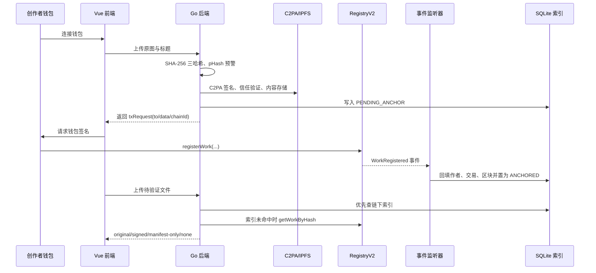

# 面试项目简介：ImageProvenance V2

> 本文用于面试中的项目介绍、简历项目栏和技术面展开。项目数据以仓库中的代码、测试报告和性能报告为准；其中“个人职责”请按实际分工调整。

## 一句话定位

ImageProvenance V2 是一个基于区块链与 C2PA 标准的图像内容确权与溯源系统：后端负责生成哈希指纹、C2PA 签名和存储内容，创作者通过自己的钱包完成上链，系统再结合链上记录、文件内声明和链下索引完成来源验证、授权管理与技术取证。

## 30 秒面试版

我实现了一个基于区块链和 C2PA 的图像确权溯源系统。创作者上传图片后，后端会生成原图、签名版和 C2PA 声明三组 SHA-256 指纹，并生成可信签名文件；但后端不持有链上私钥，只返回交易 calldata，由创作者自己的 MetaMask 钱包发送交易，因此链上的 `author` 就是实际签名者。系统支持原图、官方签名版、签名后被篡改和无记录四态验证，同时提供作者授权、撤销、分账规则和作品争议状态管理。最终合约测试 20/20、合约行覆盖率 98.55%，两轮全链路回归 76/76。

## 1～2 分钟 STAR 版

### 背景与问题

数字图像被转载或修改后，创作者通常很难证明文件来源、登记时间和授权关系。单纯把一个哈希存入链上又存在几个问题：

- 如果由后端热钱包代签，链上作者实际上是服务器地址，无法证明是创作者本人登记；
- 如果只依赖链下数据库，数据库丢失后就无法完成验证；
- 如果授权和分账合约没有作者权限校验，其他人可能操作他人的作品；
- 如果 C2PA 使用开发证书，签名虽然存在，但验证结果会是 `untrusted`，不能完整演示信任链。

### 项目目标

围绕“身份真实、内容可验、授权可控、声明可信、链下可恢复”五个目标，重构一期“上传—单哈希上链—验证”原型，形成可演示、可测试、可复现的 V2 闭环。

### 核心实现

1. **身份闭环**：后端只负责 `prepare`，生成三哈希和 `registerWork` calldata；交易由创作者钱包发送，合约使用 `msg.sender` 记录作者，后端不保存任何链上私钥。
2. **验证闭环**：`RegistryV2` 同时保存原图、签名版和 manifest 三个哈希，并通过 `hashIndex` 反查作品；验证接口在链下索引未命中时回退到链上查询，再结合 C2PA manifest 判断文件是否在签名后被修改。
3. **授权闭环**：`LicenseV2` 和 `RoyaltyV2` 通过 `IRegistry.authorOf` 校验作者身份，支持授权签发、撤销、过期判断、分账比例记录和作品状态标记。
4. **信任闭环**：使用 OpenSSL 生成 P-256 Root CA 和 ES256 叶子证书，将根证书作为 trust anchor，使 c2patool 对项目签名文件返回 `Trusted`。
5. **链下同步闭环**：Go 监听器定期拉取链上事件，使用持久化游标断点续扫，并通过幂等 upsert 镜像到 SQLite；链上记录是事实源，SQLite 是查询加速索引。

## 系统工作流

## 主要功能

| 模块 | 用户可见能力 | 关键实现 |
|---|---|---|
| 创作者登记 | 上传作品、生成声明与签名、钱包确认上链 | `POST /api/works/prepare` + `txRequest` + `RegistryV2.registerWork` |
| 来源验证 | 判断原图、官方签名版、签名后篡改或无记录 | 三哈希分层命中、链上 `hashIndex` 反查、C2PA hard binding |
| 授权管理 | 指定地址、用途和期限签发授权，可撤销 | `LicenseV2` 的作者校验、过期判断、事件镜像 |
| 分账规则 | 配置创作者与平台分成比例，并在前端回显 | `RoyaltyV2` 基点制，总比例强制为 10000 |
| 作品状态 | 标记 Active、Disputed、Revoked，并在验证页提示 | `WorkStatusChanged` 事件、SQLite 镜像、前端警示 |
| 可信声明 | 生成 C2PA manifest 并验证为 Trusted | ES256 demo CA + trust anchor + c2patool |
| 取证材料 | 导出包含哈希、时间戳和二维码的 PDF | 区块时间 + RFC3161 时间戳 + 验证页链接 |
| 存储与预警 | IPFS 内容寻址存储，未启动 IPFS 时本地回退；近似图提示 | `storage.Store` 抽象、pHash 汉明距离阈值 10 |

## 技术栈

| 层次 | 技术选型 | 在项目中的作用 |
|---|---|---|
| 区块链 | Solidity 0.8.20、Hardhat、本地 EVM chainId 31337 | 作品登记、哈希反查、授权、分账规则和状态记录 |
| 智能合约 | `RegistryV2`、`LicenseV2`、`RoyaltyV2`、`MockJudicialAnchor` | 将身份和权限约束放到链上执行 |
| 后端 | Go 1.25、Gin、`modernc.org/sqlite` | REST API、文件处理、事件同步、PDF 生成 |
| 内容凭证 | C2PA 2.x、c2patool、OpenSSL ES256 | 文件内来源声明、签名和信任链验证 |
| 存储 | IPFS/Kubo、本地内容寻址回退 | 保存签名图片、manifest 和验证报告 |
| 前端 | Vue 3、Vue Router、ethers.js v6、MetaMask | 创作者、授权管理和来源验证三个视图 |
| 测试与工程化 | Hardhat 测试、Go 单测、Node E2E、性能采集脚本 | 正向流程、攻击用例、回归与性能验证 |

## 面试最值得展开的设计点

### 1. 为什么后端不代签

代签方案实现简单，但会让链上作者固定为服务器地址，平台可以替用户完成登记，身份闭环不成立。V2 采用“后端准备、钱包发送”的 `txRequest` 模式：后端可以生成 calldata，但不能伪造创作者的 `msg.sender`。代价是用户必须连接钱包并承担 gas；后续可用 EIP-712 元交易设计将签名权与 gas 支付权分离。

### 2. 为什么使用三哈希

三组哈希分别对应原始文件、官方 C2PA 签名分发文件和 manifest 声明。它们既能区分“原始文件”和“官方分发文件”，又能在数据库缺失时通过任意哈希在链上反查作品。代价是登记交易存储更多数据、gas 更高，但换来了防重复登记和链上可恢复验证能力。

### 3. 为什么链下还需要 SQLite

区块链适合做不可篡改事实记录，不适合直接承担复杂列表和授权记录查询。监听器把链上事件镜像到 SQLite，查询更快、前端更简单；游标、幂等 upsert 和链上回退保证索引不是唯一事实源，数据库丢失后仍可从链上重建或验证。

### 4. C2PA Trusted 的含义

数字签名证明“持有对应私钥的一方签过声明”，`Trusted` 还取决于验证方是否信任签发证书的根。项目用自建 demo CA 展示了同一文件在默认信任列表下为 `untrusted`、加载 Root CA 后为 `Trusted` 的差异；生产环境仍需接入 C2PA 信任列表成员证书。

## 项目边界

面试时应主动说明：当前版本运行在本地开发链，不宣称已经部署公链；`RoyaltyV2` 只记录分账比例，不执行真实收款或自动分账；pHash 只做相似预警，不是完整的以图搜图系统；`MockJudicialAnchor` 只保留接口和事件形态，不代表已接入真实司法链；系统提供技术取证材料，不替代司法鉴定，也不能证明作品在首次上链之前就是真实原创。

## 一句话收尾

这个项目的核心不是“把哈希写进区块链”，而是把创作者身份、文件内容、C2PA 声明、授权权限和链下索引组织成一个可以被验证、被测试、被恢复的完整工程闭环。

## 相关项目材料

- [项目成果](12-项目成果.md)
- [面试讲述指南](08-面试讲述指南.md)
- [演示脚本](06-演示脚本.md)
- [威胁模型与安全性分析](10-威胁模型与安全性分析.md)
- [README](../README.md)
