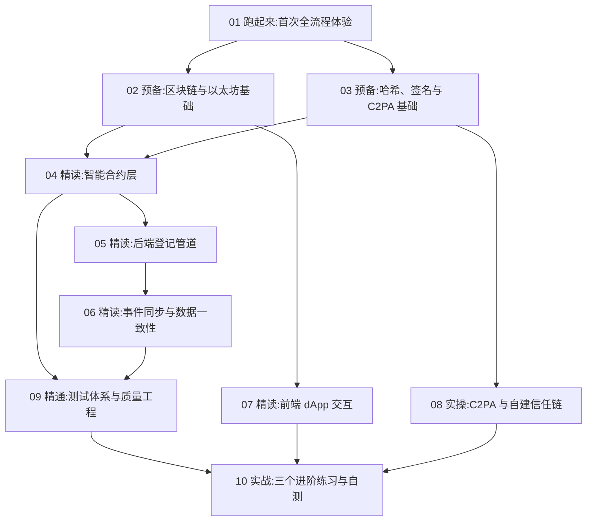

# 学习本项目:完整路径

> 目标读者:要**吃透**这个项目的人——项目作者本人(备答辩/面试)、接手的同学、
> 或想以此入门"区块链 + 内容凭证"全栈开发的学习者。
> 与其他文档的关系:`manual/` 教你**用**,`docs/07、08` 教你**讲**,本目录教你**懂**。

## 三个学习深度

| 深度 | 标准 | 需要学 |
|---|---|---|
| L1 会用 | 能独立启动系统、完整演示所有功能、解释每个页面在干什么 | 第 01 章(+ manual/) |
| L2 会讲 | 能对着任意一段代码说清"它为什么存在",能回答 docs/07 全部 27 题 | 01–09 章 |
| L3 会改 | 能安全地加功能、写测试、不破坏现有设计约束 | 全部 10 章 + 实战 |

## 章节地图与依赖

| 章 | 文档 | 预计用时 | 产出检验 |
|---|---|---|---|
| 01 | [跑起来:首次全流程体验](01-跑起来-首次全流程体验.md) | 2–3h | 系统在你手上完整跑通一遍 |
| 02 | [预备:区块链与以太坊基础](02-预备-区块链与以太坊基础.md) | 3–4h | 能手动用 RPC 查块、查余额、解释一笔交易 |
| 03 | [预备:哈希、签名与 C2PA 基础](03-预备-哈希签名与C2PA基础.md) | 2–3h | 命令行完成一次哈希/签名/验签 |
| 04 | [精读:智能合约层](04-精读-智能合约层.md) | 4–6h | 逐函数讲出三合约设计动机;跑通 20 个单测 |
| 05 | [精读:后端登记管道](05-精读-后端登记管道.md) | 4–5h | 画出 prepare 十步管道图;读懂每步降级路径 |
| 06 | [精读:事件同步与数据一致性](06-精读-事件同步与数据一致性.md) | 3–4h | 亲手复现"停机→上链→重启→自动补齐" |
| 07 | [精读:前端 dApp 交互](07-精读-前端dApp交互.md) | 3–4h | 讲清 txRequest 模式;完成一个显示字段小改动 |
| 08 | [实操:C2PA 与自建信任链](08-实操-C2PA与自建信任链.md) | 3–4h | 徒手复现 trusted vs untrusted 对照实验 |
| 09 | [精通:测试体系与质量工程](09-精通-测试体系与质量工程.md) | 3–4h | 全部测试本机跑绿;为攻击用例补一个新断言 |
| 10 | [实战:三个进阶练习与自测](10-实战-进阶练习与自测.md) | 8h+ | 完成至少一个进阶练习;自测清单全部打勾 |

总计约 35–45 小时(L3 深度)。建议节奏:每天 2 小时,三周完成;或集中一周。

## 学习方法约定(每章通用)

1. **先跑后读**:每章的"动手实验"不是选做——代码读不懂时,先把实验跑出来再回头读;
2. **改坏了不要慌**:所有实验都在本地链上,`git checkout` + 重启 Hardhat 即可归零;
3. **对照测试学**:每读一个函数,找到它对应的测试用例(第 09 章有映射表),测试是最诚实的文档;
4. **自测题不跳过**:每章末尾自测题答不上来,回去重读对应小节,答案都在正文或 `docs/07`。
