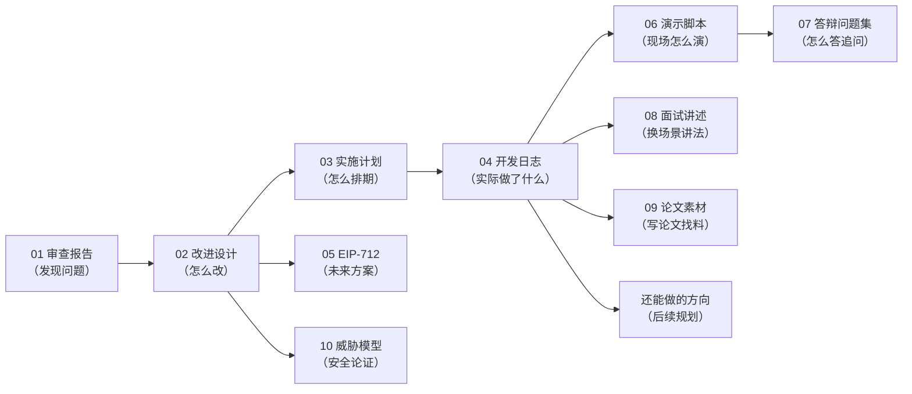

# 00 总览：docs 目录写了什么（地图）

> 先读这篇。本文把 `ImageProvenanceV2/docs/` 的全部文档画成一张地图：
> 每篇是什么、给谁看、和别的文档什么关系、建议什么时候读。

## 一、docs 是"过程文档"，不是"使用文档"

一个项目通常有三类文档，这个项目分得很清楚：

| 目录 | 定位 | 给谁看 | 回答的问题 |
|---|---|---|---|
| `manual/` | 使用手册 | 要**跑起来**的人 | 怎么安装、启动、演示 |
| `learning/` | 学习路径 | 要**吃透代码**的人 | 代码为什么这么写 |
| `docs/` | 开发论证材料 | **作者自己**（备答辩/面试/写论文） | 为什么做、怎么做的、做得对不对 |
| `reports/` | 测试与性能证据 | 同上 | 验证过没有、数据是多少 |

一句话：**manual 教你用，learning 教你懂，docs 帮你讲。**

## 二、docs 的 11 篇文档，按"叙事线"排列

docs 里其实有一条完整的故事线——**一个系统从审查到答辩的完整旅程**。按时间顺序：

```text
第 1 幕 发现问题
  01 一期设计审查报告        ← 一期系统有什么致命缺陷（审查结论）

第 2 幕 设计改进方案
  02 二期改进设计方案        ← 针对缺陷怎么改（四个"闭环"）
  03 实施计划                ← 分成 6 个里程碑，排期和验收标准
  04 开发日志                ← 每个里程碑实际做完了什么、踩了什么坑

第 3 幕 面向未来的设计
  05 EIP-712 元交易设计      ← 一个"只设计不实现"的演进方向

第 4 幕 展示与论证
  06 演示脚本                ← 答辩现场 5 分钟怎么演
  07 答辩问题集              ← 评委可能问的 27 个问题怎么答
  08 面试讲述指南            ← 换到面试场景怎么讲（和答辩不同的讲法）

第 5 幕 论文与后续
  09 论文素材索引            ← 写论文时每章素材从哪找
  10 威胁模型与安全性分析    ← 从安全角度论证系统（论文"安全性分析"章节素材）
  还能做的方向              ← 之后还能做什么（四档优先级）
```

## 三、每篇文档一句话定位

| 文档 | 一句话定位 | 谁是主角 |
|---|---|---|
| 01 一期设计审查报告 | **"我做的第一版系统有什么问题"**——审查出 8 个问题，3 个是致命的 | 一期系统 |
| 02 二期改进设计方案 | **"怎么改"**——四个闭环：身份、验证、授权、信任 | 二期系统 |
| 03 实施计划 | **"怎么排期"**——M1–M6 六个里程碑，每个有验收标准 | 工程管理 |
| 04 开发日志 | **"实际发生了什么"**——每个里程碑的完成内容、验证结果、踩坑 | 过程记录 |
| 05 EIP-712 元交易设计 | **"将来可以怎么做"**——只设计不实现，论文展望章节的素材 | 未来方案 |
| 06 演示脚本 | **"现场怎么演"**——四幕 5 分钟 + 备选加演 + 突发预案 | 答辩现场 |
| 07 答辩问题集 | **"怎么答追问"**——27 个问题，每个有 30 秒口径 + 展开 | 答辩 |
| 08 面试讲述指南 | **"换场景怎么讲"**——STAR 叙事、技术清单、踩坑故事 | 面试 |
| 09 论文素材索引 | **"写论文的找料地图"**——每章要写什么、素材在哪 | 论文 |
| 10 威胁模型与安全性分析 | **"安全上凭什么说够"**——威胁枚举 + 防御映射 + 残余风险 | 安全论证 |
| 还能做的方向 | **"接下来做什么"**——四档投入产出排序 | 未来规划 |

## 四、文档之间的依赖关系



## 五、docs 和项目其他部分的对应关系

docs 里的内容不是凭空说的，每一条都有对应物：

| docs 里说的 | 实际对应 | 在哪 |
|---|---|---|
| "合约 V2 四个合约" | 真实的 Solidity 源码 | `contracts/contracts/*.sol` |
| "攻击性测试" | 真实测试用例 | `contracts/test/*.test.js` |
| "76/76 回归通过" | 测试报告 | `reports/test-results/` |
| "prepare 799ms" | 性能采集数据 | `reports/test-results/performance-table.md` |
| "C2PA trusted" | 信任对照实验 | `reports/test-results/c2pa-trust-comparison.md` |
| "四态验证" | 前端验证页面 | `web/src/views/VerifyView.vue` |
| "断点续扫" | 事件监听代码 | `backend/internal/chain/listener.go` |
| "自建 CA" | 证书生成脚本 | `tools/ca/` |

> 读 docs 时如果看到"实测"、"已验证"这类词，去 reports/ 找对应报告——docs 是叙事，reports 是证据。

## 六、阅读建议（不同角色的路线）

| 你是谁 | 建议路线 |
|---|---|
| 刚接手项目的人 | 01 → 02 → 03/04 → 09 术语表，先建立"为什么这么做"的认知 |
| 要答辩的人 | 06 → 07 是重点，01/02 是背景，10 是安全口径 |
| 要面试的人 | 08 是重点，配合 01–04 的"决策+踩坑"素材 |
| 要写论文的人 | 09 是地图，01/02 供第 3 章，10 供安全章节，04 供踩坑章节 |
| 只想了解这个系统值不值得学 | 01（问题）+ 02（方案）就够，10 分钟读完 |

## 回到正片

现在你对 docs 全貌有概念了，可以选一篇开始：

- 想了解"为什么这个系统要重做" → 去读 `docs/01-一期设计审查报告.md`（配本包 01 篇）
- 想了解"改进方案" → 去读 `docs/02-二期改进设计方案.md`（配本包 01 篇）
- 想直接跳到答辩 → 去读 `docs/06` 和 `docs/07`（配本包 04 篇）