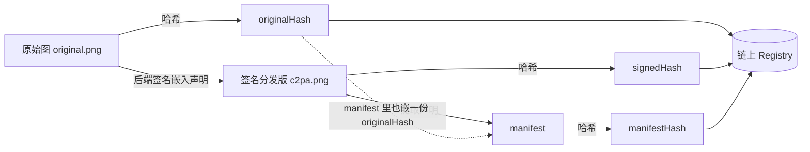
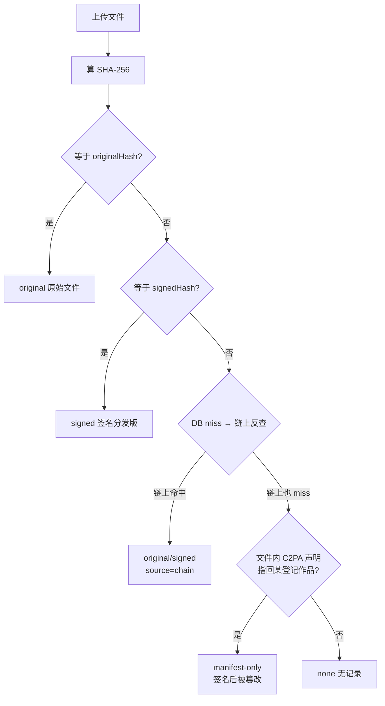

# 04 全景图：架构、数据流、三哈希与验证四态

> 目标：把整个项目装进一张图里，让你在任何时刻都能回答"现在这一步发生在哪个进程、
> 数据从哪来、到哪去"。这是**通读型**文档——第一遍读个大概，之后每学一章回来对照一次。
> 图中所有细节都来自项目真实代码与文档（`docs/02`、`learning/04~07`）。

## 4.1 一张图看懂整个系统

```mermaid
flowchart LR
    subgraph 你的浏览器[浏览器 dApp（Vite, :5173）]
        UI[CreatorView / LicenseView / VerifyView]
        Wallet[MetaMask 钱包插件<br/>保管私钥·签名·链上身份]
    end

    subgraph 后端[Go 后端（:8080）]
        API[/api/works/prepare 等 REST 接口/]
        PIPE[登记管道: 哈希→pHash→C2PA签名→IPFS→打包交易]
        DB[(SQLite 索引<br/>works/licenses/chain_cursor)]
        LISTENER[链监听器<br/>每 2s 扫事件]
        CA[(tools/ca 自建证书)]
    end

    subgraph 链[Hardhat 开发链（:8545）]
        REG[RegistryV2 作品登记簿]
        LIC[LicenseV2 授权记录簿]
        ROY[RoyaltyV2 分账规则簿]
        JUD[MockJudicialAnchor 司法存证]
    end

    subgraph 存储[存储]
        IPFS[IPFS 或本地对象存储<br/>backend/data/objects]
    end

    UI -->|1 上传图片+标题| API
    API --> PIPE
    PIPE -->|2 算哈希/签名/存文件| IPFS
    PIPE -->|3 读 ABI 打包交易| API
    API -->|4 返回 txRequest| UI
    UI -->|5 请求签名| Wallet
    Wallet -->|6 用户确认→广播交易| REG
    REG -->|7 emit 事件| LISTENER
    LISTENER -->|8 写入| DB
    LISTENER -->|9 更新缓存/状态| API
    API -->|10 查询| DB
    DB -.链上反查兜底.-> REG
    UI -->|授权/分账/状态标记<br/>直接调合约(不经后端)| LIC
    UI --> ROY
    UI --> JUD
```

**一句话版本**：浏览器负责"人和钱包"，后端负责"计算和存储"，链负责"不可抵赖的记账"，
三者各司其职，谁也不越界（后端不碰私钥、链不存图片、浏览器不自己算哈希）。

## 4.2 四个合约各自管什么

| 合约 | 职责 | 关键状态 | 谁在写 |
|---|---|---|---|
| `RegistryV2` | 作品登记簿 | workId → {作者, 三哈希, CID, 状态} | 作者本人（`msg.sender` 验证） |
| `LicenseV2` | 授权记录簿 | workId → [授权记录] | 作者签发 / 授权人撤销 |
| `RoyaltyV2` | 分账规则簿 | 作者/平台分成比例 | 作者设置 |
| `MockJudicialAnchor` | 司法存证接口 | 存证登记 | 测试/演示用 |

> 记忆口诀：**Registry 管"这图是谁的"，License 管"谁能用"，Royalty 管"钱怎么分"**。

## 4.3 三份哈希：同一个作品的三个"指纹"

登记一个作品，后端会算三个哈希并全部上链。这是全项目最容易被绕晕的地方，一次讲清：

| 哈希 | 对什么算 | 代表什么 | 存在哪 |
|---|---|---|---|
| `originalHash` | 你上传的**原始图片文件** | "作者手里的原稿" | 链上 + DB + 嵌进 C2PA 声明 |
| `signedHash` | **签名分发版**文件（嵌了 C2PA 声明的成品图） | "官方发布的版本" | 链上 + DB |
| `manifestHash` | 文件内 C2PA **声明内容**本身 | "声明这份文件没被调包" | 链上 + DB |



**为什么是三份而不是一份**：验证时要回答三个不同的问题——"这是原稿吗"（H1）、
"这是官方分发版吗"（H2）、"这份声明还完好吗"（H3）。一份哈希答不了三个问题。

## 4.4 验证四态：核心业务逻辑（背下来）

用户上传任意一个文件，后端按**顺序**问四个问题，命中即返回对应状态：

```text
计算上传文件的 SHA-256
  ├─ ① 等于某作品的 originalHash ?   → original    「原始文件」（作者原稿）
  ├─ ② 等于某作品的 signedHash  ?    → signed      「官方签名分发版」
  ├─ ③ 本地 DB 全没命中
  │      → 去链上 getWorkByHash 兜底（本地库删了也能验）
  │      → 命中 → 按哪个哈希相等定 original / signed（source=chain）
  ├─ ④ 链上也没有
  │      → 用 c2patool 读文件里幸存的 C2PA 声明
  │      → 声明里的 originalHash 指向某登记作品 → manifest-only
  │         =「签名后被篡改」（声明还在，但文件已不是登记时的字节）
  └─ 全部落空                            → none         「无记录」
```



**最容易混淆的一个点**（原 learning/01 自测 4）：篡改**原图** → 哈希全变、文件里
根本没有 C2PA 声明 → 落到 `none`；篡改**签名分发版** → 声明还嵌在文件里幸存 → 落到
`manifest-only`。**想演示"签名后被篡改"，必须改签名分发版**。

## 4.5 登记全流程（prepare 十步管道）

后端 `/api/works/prepare` 收到一张图后做的事（原 learning/05 的骨架）：

```text
1  校验 title 是合法 UTF-8（防 Windows curl 中文乱码）      → 非法直接 400
2  算 originalHash（原图指纹）
3  查重（三个哈希各自查 DB，撞了返回 409 防抢注）
4  算 pHash（感知哈希，做相似图预警，不拦截只提示）
5  用自建 CA 给 manifest 签名，嵌进图片 → 生成签名分发版
6  存原图 + 签名分发版（IPFS 或本地对象存储）→ 得到 CID
7  算 signedHash（分发版指纹）
8  算 manifestHash（声明内容指纹）
9  打包交易：abi.Pack(registerWork, 三哈希 + 标题 + CID...) → txRequest
10 落一条 pending 记录到 DB，返回 txRequest 给前端
```

之后前端拿 txRequest 请 MetaMask 签名 → 交易上链 → 链上发事件 → 后端监听器
2 秒内扫到 → 更新 DB 状态 → 前端刷新可见。**从"上链成功"到"页面表格出现"那 3 秒，
就是这条链路的时延**（原 learning/01 观察任务 3 的答案）。

**注意第 9 步**：后端懂 ABI 但**没有你的私钥**，所以它只能"打包"，不能"发送"；
前端有签名权但不懂业务参数。这就是 `txRequest` 模式——**知识与权力分离**，
也是整个项目"后端零私钥"（`signer mode: creator-wallet`）的由来。

## 4.6 授权/分账/状态：另一条更短的路

登记必须走后端（三哈希只有后端算得出来），但**授权、分账、状态标记不走后端**：
前端直接用合约 ABI（从后端 `/api/chain/info` 动态拉取）+ 钱包签名直调合约。
你的设置（比如 85/15 分账）只存在**链上**，所以刷新页面后回显还在——
**因为每次回显都是实时从链上读的，后端数据库里根本没有它**。

## 4.7 数据一致性：后端数据库与链的"对账"

后端 SQLite 里的记录是**链上事件的镜像**（通过监听器复制过来的），不是独立真相。
这个设计的三个性质（原 learning/06 的精髓）：

1. **链是唯一真相**：数据库删了没关系，链上反查兜底 + 全量重扫重建；
2. **断点续扫**：后端宕机期间别人照样能上链，重启后监听器从上次的游标接着扫，
   自动补齐漏掉的事件（日志里的 `anchored: chainWorkId=...`）；
3. **幂等安全**：重扫同一批事件不会产生重复记录。

所以整个系统的可靠性排序是：**链 > 数据库 > 前端显示**。想破坏演示？
删 `backend/data/index.db` 重启后端，一切自动恢复。

## 4.8 用这张图回答的五个高频问题

1. **为什么上链要 MetaMask 确认？** 后端没私钥，签名权在你这（4.5 第 9 步）。
2. **为什么授权记录要等 3 秒？** 事件广播 → 2s 轮询 → 处理 → 前端刷新（4.5 末尾）。
3. **为什么刷新后分账比例还在？** 每次回显实时读链，不是存数据库（4.6）。
4. **为什么删了数据库验证照样工作？** 链上反查兜底（4.4 第 ③ 步、4.7）。
5. **为什么重启 Hardhat 一切归零？** 假链数据在内存；归零手顺见 01 篇 1.6。

## 回到正片

这张图是原 `learning/04~07` 的**目录**。现在回去按顺序精读：
- 想深挖"链上怎么记账" → 原 04 章（合约层）
- 想深挖"后端十步管道" → 原 05 章
- 想深挖"3 秒延迟" → 原 06 章
- 想深挖"txRequest 模式" → 原 07 章（前端）

每读完一章，回来对照 4.x 对应小节，把"图上知道"变成"代码里见过"。